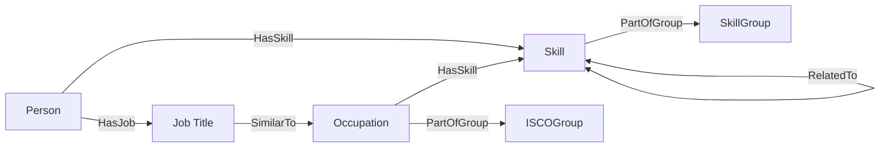

# Neo4J Database Model

## Schema visualization

## Node properties table

### Skill

Skills and competences
| Properties     | Description                                 |
|----------------|---------------------------------------------|
| preferredLabel | How the skill is named in our database      |
| altLabels      | Other namings of the skill                  |
| conceptUri     | Unique ID of the skill                      |
| description    | Description                                 |
| skillType      | Type of skill (e.g. Knowledge / competence) |

### SkillGroup
Categorization of skills (Taxonomy)  

| Properties     | Description                                 |
|----------------|---------------------------------------------|
| preferredLabel | How the skill is named in our database      |
| conceptUri     | Unique ID of the skill                      |
| description    | Description                                 |

### Person

User of the app  

| Properties     | Description                                 |
|----------------|---------------------------------------------|
| name           | Name                                        |
| company        | Company                                     |
| id             | Unique ID                                   |

### Occupation

 Standardized list of job titles  
 

| Properties     | Description                                 |
|----------------|---------------------------------------------|
| preferredLabel | How the occupation is named in our database |
| altLabels      | Other namings of the occupation             |
| conceptUri     | Unique ID of the occupation                 |
| description    | Description                                 |

### ISCOGroup

Categorization of job titles (Taxonomy)

| Properties     | Description                                 |
|----------------|---------------------------------------------|
| preferredLabel | How the skill is named in our database      |
| conceptUri     | Unique ID of the skill                      |
| description    | Description                                 |

### JobTitle

Actual job title of the user  

| Properties     | Description                                 |
|----------------|---------------------------------------------|
| label          | Label                                       |
| id             | Unique ID                                   |
